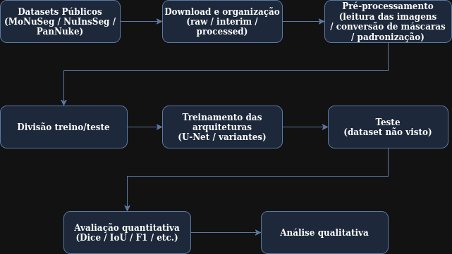

# Segmentação de núcleos em imagens histológicas com deep learning: comparação entre arquiteturas e datasets
# Nuclei segmentation in histological images using deep learning: A comparison between architectures and datasets

## Apresentação

O presente projeto foi originado no contexto das atividades da disciplina de pós-graduação *IA901 - Análise de Imagens e Reconhecimento de Padrões*, 
oferecida no primeiro semestre de 2026, na Unicamp, sob supervisão da Profa. Dra. Leticia Rittner, do Departamento de Engenharia de Computação e Automação (DCA) da Faculdade de Engenharia Elétrica e de Computação (FEEC).

|Nome  | RA | Curso|
|--|--|--|
| Alysson Matos de Souza  | 265057  | Doutorado em Engenharia Elétrica |
| Lucas Fiuza Garcia  | 300901  | Mestrado em Engenharia Elétrica |
| Vinicius Barbosa Bassete  | 248135  | Mestrado em Física Aplicada|

## Descrição do Projeto

A segmentação de núcleos celulares em imagens histológicas é uma tarefa importante em patologia digital e visão computacional aplicada à área médica. A identificação precisa dessas estruturas pode auxiliar análises quantitativas, estudos morfológicos e sistemas computacionais de apoio ao diagnóstico. Nos últimos anos, modelos baseados em deep learning passaram a apresentar resultados promissores nesse tipo de tarefa. Entretanto, imagens histológicas obtidas em laboratórios distintos podem apresentar diferenças significativas de resolução, coloração, qualidade de aquisição, tipos celulares e distribuição dos tecidos, fazendo com que modelos treinados em um determinado dataset não necessariamente apresentem o mesmo comportamento em outros cenários.

Nesse contexto, o presente projeto busca investigar o comportamento de arquiteturas de segmentação quando aplicadas a datasets histológicos com características distintas. A proposta procura se aproximar de um problema mais realista de adaptação de domínio, avaliando como diferentes modelos se comportam em situações de transferência entre bases de dados.

Para isso, serão utilizados três datasets públicos amplamente utilizados na literatura: MoNuSeg, PanNuke e NuInsSeg. Inicialmente, pretende-se realizar experimentos de treinamento e teste entre diferentes bases, analisando qualitativamente e quantitativamente os resultados obtidos. Posteriormente, também serão exploradas estratégias relacionadas a fine-tuning e adaptação de domínio.

## Metodologia

O projeto está sendo desenvolvido seguindo um pipeline dividido em etapas de:

- **instalação**, onde os datasets são obtidos automaticamente a partir de suas fontes públicas e organizados em diferentes diretórios seguindo uma estrutura de reprodutibilidade composta pelas pastas raw, interim e processed;

- **pré-processamento**, responsável pela padronização dos dados provenientes dos diferentes datasets. Essa etapa inclui carregamento das imagens histológicas, conversão e organização das máscaras de segmentação, leitura de arquivos XML, além da visualização das amostras para utilização posterior no treinamento das redes neurais;

- **treinamento**, onde os experimentos de segmentação serão realizados utilizando arquiteturas de deep learning voltadas para imagens médicas, incluindo modelos baseados em U-Net e suas variantes;

- **teste**, onde o modelo treinado será aplicado a um conjunto de dados ainda não visto;

- **avaliação e análise dos resultados**, que será realizada utilizando métricas quantitativas de segmentação, como Dice Score, IoU, Recall e F1-score. Também está prevista a utilização de métricas complementares relacionadas à qualidade de borda e sobreposição entre máscaras. Além disso, pretende-se realizar análises qualitativas das segmentações produzidas pelos modelos.

## Bases de Dados e Evolução

Base de Dados | Endereço na Web | Resumo descritivo
----- | ----- | -----
PanNuke | https://warwick.ac.uk/fac/cross_fac/tia/data/pannuke/ | Grande dataset com 7904 amostras de imagens histológicas de diferentes tecidos, além de máscaras de segmentação e anotaçãoe sobre a histologia. Este dataset se destaca pela quantidade e diversidade nas amostras.
NuInsSeg | https://www.kaggle.com/datasets/ipateam/nuinsseg | Dataset com 665 amostras de imagens histológicas anotadas, desenvolvido com foco em treinar e avaliar modelos de segmentação de núcleos celulares em imagens de microscopia.
MoNuSeg | https://monuseg.grand-challenge.org/Data/ | Dataset com 44 imagens histopatológicas de diversos órgãos em alta resolução com anotações feitas manualmente por especialistas. Criado originalmente para uma competição, se tornou um benchmark frequentemente usado em pesquisas de patologia digital.

O detalhamento sobre os datasets utilizados pode ser encontrado no [datasheet desenvolvido pelo grupo](data/Datasheets.md).

## Ferramentas

O projeto está sendo desenvolvido em Python, utilizando bibliotecas voltadas para manipulação de dados, processamento de imagens e treinamento de modelos de deep learning.

Entre as principais bibliotecas utilizadas até o momento, destacam-se:

- **NumPy**: operações matriciais e manipulação eficiente de arrays.

- **Pandas**: organização e leitura de tabelas e metadados dos datasets.

- **Pathlib** e **os**: gerenciamento de diretórios e estrutura de arquivos.

- **gdown**, **zipfile** e **shutil**: download, extração e organização automatizada dos datasets.

- **PIL** e **scikit-image**: leitura e manipulação de imagens histológicas.

- **xml.etree.ElementTree**: processamento das anotações em formato XML presentes no MoNuSeg.

- **Matplotlib**: visualização de imagens e máscaras de segmentação.

- **PyTorch**: desenvolvimento e treinamento das redes neurais.

- **MONAI**: framework especializado em aplicações de deep learning para imagens médicas, utilizado para implementação das arquiteturas de segmentação.

## Workflow

O workflow atual do projeto segue a estrutura ilustrada abaixo:

## Experimentos e Resultados preliminares

Para cada dataset, realizou-se o treinamento de três tipos de redes neurais: UNET, AttentionUnet e UNETR, disponíveis no pacote Python MONAI. Os conjunto de treino, validação e teste foram divididos seguindo uma proporção de 70%, 15% e 15%, respectivamente. 

#### Transformações aplicadas as imagens e máscaras
De forma geral, aplicou-se transformações de Normalização de intensidade e rotações aleatórias nas imagens do conjunto de treino.

#### Treinamento
Aplicou-se os mesmos hiperparâmetros para todos os tipos de redes utilizados, independente do dataset escolhido:
- Otimizador: ADAM
- Learning Rate: $10^{-4}$
- Batch Size: 16
- Número de épocas: 50

#### Resultados preliminares
Com as redes treinadas em cada dataset, obteve-se, nos respectivos conjuntos de teste, os seguintes DICES médios:

| Dataset | UNET | AttentionUnet | UNETR |
| --- | --- | --- | --- |
| **MoNuSeg** | $0.75 \pm 0.10$ | $0.77 \pm 0.09$ | $0.79 \pm 0.07$ |
| **PanNuke** | $0.81 \pm 0.18$ | $0.82 \pm 0.18$ | $0.80 \pm 0.18$ |
| **NuInSeg** | $0.74 \pm 0.22$ | $0.77 \pm 0.22$ | $0.73 \pm 0.22$ |

## Próximos passos
Essa etapa do projeto consistiu na criação de sua estrutura e testes iniciais das ferramentas e datasets utilizados. Para a conclusão do projeto, os próximos passos focam na melhoria do treinamento, além de testes com aplicação mais focada em seu objetivo inicial.

Passo | Descrição | Período de realização
---- | ---- | ----
Inclusão de métricas            | Estudar mais a fundo e incluir no projeto métricas de avaliação de borda, como a Distância de Hausdorff Média ou a Distância de Superfície Simétrica, com o objetvo de complementar o DICE (métrica de sobreposição). | Semana 1
Refinamento do treinamento      | Refinar o treinamento e ajustar hiperparâmetros à partir da análise das métricas de avaliação | Semanas 2 e 3
Testes em diferentes datasets   | Realizar testes dos modelos com dados de bases não introduzidas em seu treinamento (utilizando o MoNuSeg como conjunto de teste de um modelo treinado e validado no PanNuke por exemplo) | Semanas 2 e 3
Análise final                   | Análisar os resultados finais para preparar a entraga final | Semana 4
Organização para a entrega      | Organizar dados sobre o desenvolvimento e execução do projeto no formato esperado para a entrega final | Semana 4

## Uso de IA Generativa
- Implementação de script para geração de samples: O Claude foi utilizado para gerar um script base de geração da pasta '*\data\samples'. Foram feitas diversas adaptações em cima desse script base, para que essa geração se adequasse ao projeto.
    - Prompt Utilizado: "baseado no notebook (00_installation.ipynb), implemente um script que gere samples para os dados dos datasets"

- Interpretação inicial dos artigos referenciados no projeto: O NotebookLM foi utilizado para auxílio na síntese de informações presentes nos artigos sobre os datasets e sobre estruturação de datasheets para datasets.
    - Prompt Utilizado: "com base na estrutura de um datasheet sugerida pelo artigo Datasheets for Datasets, busque nos artigos dos datasets as informações necessárias para o preenchimento das seções"

## Referências

¹ GEBRU, Timnit et al. *Datasheets for Datasets*. arXiv preprint arXiv:1803.09010, 2021.

² KUMAR, Neeraj et al. *A Multi-Organ Nucleus Segmentation Challenge*. IEEE Transactions on Medical Imaging, v. 39, n. 5, p. 1380–1391, 2020.

³ LJUBENOVIĆ, M. et al. *NuInsSeg: A Fully Annotated Dataset for Nuclei Instance Segmentation in H&E-Stained Histological Images*. arXiv preprint arXiv:2207.04643, 2022.

⁴ GAMPER, Jevgenij et al. *PanNuke: An Open Pan-Cancer Histology Dataset for Nuclei Instance Segmentation and Classification*. In: European Congress on Digital Pathology. Springer, 2019. p. 11–19.